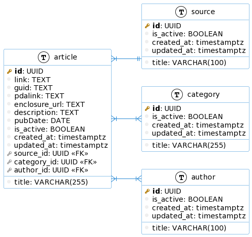

[](https://www.python.org/)

# Проект № 1.

## Анализ публикуемых новостей

### Техническое задание

**Общая задача:** создать ETL-процесс формирования витрин данных для анализа публикаций новостей.

**Подробное описание задачи:**

* Разработать скрипты загрузки данных в 2-х режимах:
    * Инициализирующий – загрузка полного слепка данных источника
    * Инкрементальный – загрузка дельты данных за прошедшие сутки

* Организовать правильную структуру хранения данных
    * Сырой слой данных
    * Промежуточный слой
    * Слой витрин

В качестве **результата работы** программного продукта необходимо написать скрипт, который формирует витрину данных следующего содержания

* Суррогатный ключ категории
* Название категории
* Общее количество новостей из всех источников по данной категории за все время
* Количество новостей данной категории для каждого из источников за все время
* Общее количество новостей из всех источников по данной категории за последние сутки
* Количество новостей данной категории для каждого из источников за последние сутки
* Среднее количество публикаций по данной категории в сутки
* День, в который было сделано максимальное количество публикаций по данной новости
* Количество публикаций новостей данной категории по дням недели

**Дополнение:**

Т.к. в разных источниках названия и разнообразие категорий могут отличаться, вам необходимо привести все к единому виду.

**Источники:**

[https://lenta.ru/rss/](https://lenta.ru/rss/)

[https://www.vedomosti.ru/rss/news](https://www.vedomosti.ru/rss/news)

[https://tass.ru/rss/v2.xml](https://tass.ru/rss/v2.xml)

## Реализация

### Используемые технологии

- **PostgreSQL** — реляционное хранилище данных.

### Структура проекта
* `architecture` - описана архитектурная структура проекта.  
* `data` - хранилище для спарсеных файлов.
* `Dockerfiles` - файлы настройки докер-контейнеров.
* `etl` - etl-сервис.
* `parser` - парсер rss-лент.
* `showcase.sql` - sql-запрос для формирования витрины данных.

### Схема проекта


### Схема базы данных


### Запуск
Для запуска проекта используйте `docker-compose`.  

Предварительно нужно скопировать и переименовать файлы `.env.example` на `.env`.

Также проект можно запустить локально, воспользовшись настройками, размещенными по: `etl\core\config.py`.

```bash
$ docker-compose up -d  --bulid 
```

### Примечание
* Переработан запуск проекта в двух режимах:
  1. первый запуск (инициализирующий);
  2. регулярный запуск (инкрементальный).
* Промежуточный слой не сохранялся
(потеря данных на этапе перехода данных из сырых в БД регулируется сохранением состояния).
